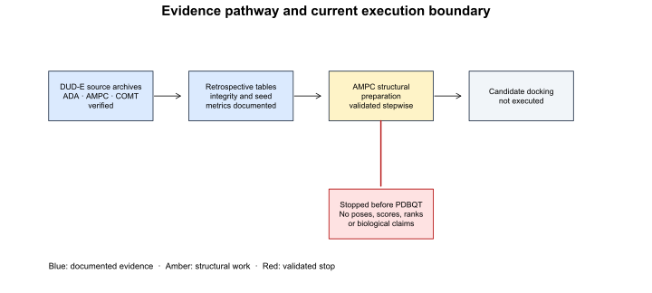
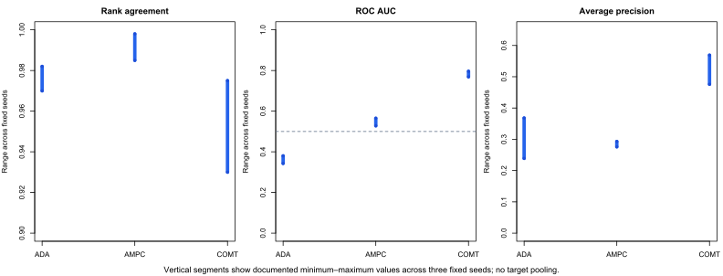
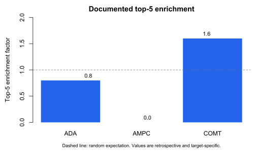

# Supplementary evidence note

## Purpose

This note accompanies the manuscript draft as a transparent visual record of
the documented retrospective pilot and subsequent implementation checks. It
does not add docking outcomes beyond those already reported in the manuscript.

## Figure S1. Evidence pathway and current execution boundary

**Legend.** Public DUD-E source archives for ADA, AMPC and COMT were acquired
locally and recorded with checksums. The documented pilot analyses concern
precomputed tables only. The subsequent AMPC Tier 2 implementation was
deliberately stopped when receptor validation did not produce an accepted PDBQT
file. Therefore, candidate docking, poses, new scores, ranks and biological
claims remain absent.

## Figure S2. Target-specific retrospective ranges

**Legend.** Each vertical segment is the documented minimum–maximum range over
three fixed seed scenarios for one target. ADA, AMPC and COMT are shown
separately; no cross-target pooled value is calculated. The ROC-AUC dashed line
marks the 0.5 random-classification reference. These are retrospective
summaries of the documented tables and labels, not prospective-performance
estimates.

## Figure S3. Target-specific top-5 enrichment

**Legend.** Top-5 enrichment factors were 0.8 for ADA, 0.0 for AMPC and 1.6
for COMT. The dashed line denotes the random expectation of one. Differences
are retained rather than pooled because the targets and score distributions are
not interchangeable.

## Procedural trace for the AMPC implementation check

1. The DUD-E AMPC archive was acquired from the official target page and its
   checksum and record counts were retained locally.
2. The original DUD-E receptor failed direct and ProDy-assisted Meeko parsing
   because its PDB element fields were blank.
3. RCSB PDB 1L2S was evaluated as a documented candidate because DUD-E cites
   it for AMPC. The coordinate file had complete element fields.
4. Chain A protein and the STC 1115 reference ligand were separated with
   checksummed source selections.
5. A narrowly prespecified PDBFixer procedure completed missing heavy atoms
   without adding residues, hydrogens or minimization.
6. The repaired receptor failed Meeko acceptance due to inter-residue padding
   conflicts and was rejected. No workaround, docking command or score
   generation followed.

## Reporting requirements

- Refer to structural preparation as an implementation check, not validation of
  the docking model.
- Retain the four deviation records and source/derived manifests with the
  supplementary material.
- Do not describe the AMPC Tier 2 route as completed, reproducible end-to-end,
  or evidence of ligand binding.
- Update this note only after an independently reviewed structural-preparation
  policy and a successful acceptance check.
