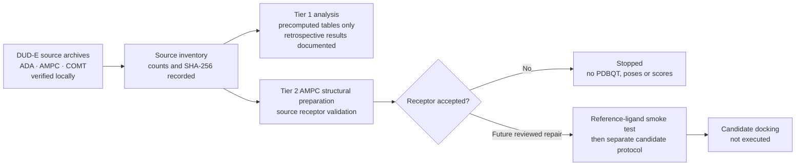

# Evidence status report

**Report date:** 2026-08-09  
**Study state:** retrospective analysis complete; end-to-end AMPC implementation stopped at receptor validation.

## What this report does and does not show

This report distinguishes documented retrospective results from newly executed
source acquisition and structural-preparation checks. It contains no new docking
scores, binding claims, biological activity claims, or prospective-screening
results.

## Visual evidence pathway

## Documented retrospective pilot results

These figures originate from the already documented local pilot tables; their
raw tables are not redistributed in this repository.

| Target | Rows per seed | Seed rankings | Spearman range | ROC AUC range | Average precision range | Top-5 enrichment |
|---|---:|---:|---:|---:|---:|---:|
| ADA | 24 | 3 | 0.970–0.982 | 0.343–0.380 | 0.239–0.368 | 0.8 |
| AMPC | 24 | 3 | 0.985–0.998 | 0.528–0.565 | 0.276–0.293 | 0.0 |
| COMT | 24 | 3 | 0.930–0.975 | 0.769–0.796 | 0.476–0.569 | 1.6 |

All nine documented target-seed tables met the stated integrity contract: 24
rows, 24 unique ligands, no duplicated ligand-scenario pairs, no invalid
identifiers, no non-finite scores, and no missing declared pairs. Metrics remain
target-specific and retrospective.

## New source and environment verification

| Item | Verified observation | Reproducibility record |
|---|---|---|
| ADA archive | 93 active records; 5,450 decoy records | SHA-256 `333B9A0DD9D56CFF6E622E7BC72D72F92D2EA68614571A65E34B5499B49029E2` |
| AMPC archive | 48 active records; 2,850 decoy records | SHA-256 `886B31A35FA5D1E68051F543853A7C43FEA14127B7C35EB8D626E4874BBA3763` |
| COMT archive | 41 active records; 3,850 decoy records | SHA-256 `545F5778D007536741CD05D2F8C855318588C3956AC8A55F1559DB031D3709FD` |
| Docking environment | Vina 1.2.7; Meeko 0.7.1; RDKit 2026.03.5; ProDy 2.6.1; PDBFixer 1.12.0 | Local manifests under ignored `external-tools/` |

## AMPC Tier 2 procedure and outcome

| Procedure stage | Evidence | Outcome | Interpretation |
|---|---|---|---|
| DUD-E receptor parsing | 3,409 atom/heteroatom rows lack PDB element fields | Stopped | Neither Meeko direct parsing nor the ProDy route produced a receptor. |
| RCSB candidate identification | 1L2S has 5,916 atom/heteroatom rows and no blank element fields | Candidate retained | A format-compatible source was documented; it did not silently replace DUD-E input. |
| Chain-A selection | 2,737 protein atom records; 19 STC reference-ligand records | Selection completed | Chain A protein and STC 1115 were separated with source/output checksums. |
| Missing-heavy-atom repair | Ten existing residues completed; no full residues or hydrogens added | Repair completed but rejected | The produced model is computationally repaired, not experimental. |
| Meeko acceptance validation | Inter-residue padding conflict for A:262/A:296 and A:264/A:282 | Stopped | No PDBQT receptor, docking pose, score, ranking or performance metric was produced. |

## Visual status matrix

| Evidence component | State |
|---|---|
| DUD-E source acquisition | ✅ verified |
| Input checksums and inventories | ✅ verified |
| Retrospective analysis report | ✅ documented |
| Tier 1 independent-analysis runner | ✅ prepared; awaits independent normalized tables |
| AMPC receptor usable for Vina | ⛔ not accepted |
| Reference-ligand smoke test | ⬜ not executed |
| Candidate docking campaign | ⬜ not executed |
| New biological or binding claim | ⛔ not supported |

## Decision log and next gate

The four deviations record why automatic repairs or bypasses were not used.
The next gate is a reviewed structural-preparation strategy that explicitly
handles crystallographic disorder and connectivity, followed by an independent
validation of the repaired receptor. Only after that gate should a separate
reference-ligand smoke test be considered.

## Sources

- DUD-E target registry and source archives: <https://dude.docking.org/targets>
- DUD-E citation: Mysinger MM, Carchia M, Irwin JJ, Shoichet BK (2012),
  DOI <https://doi.org/10.1021/jm300687e>.
- RCSB PDB 1L2S: <https://www.rcsb.org/structure/1L2S>.
- PDBFixer method documentation: <https://github.com/openmm/pdbfixer/blob/master/Manual.html>.
